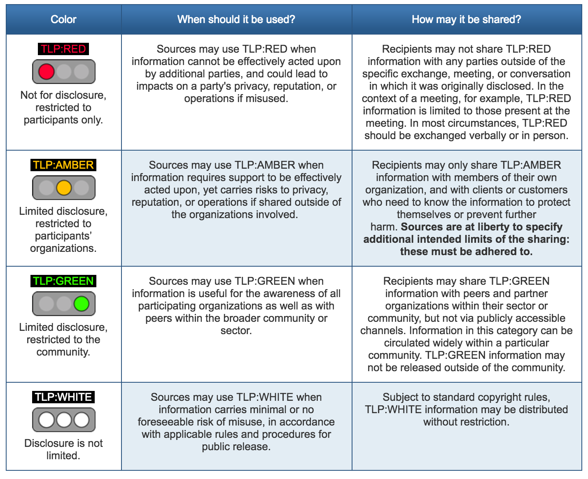
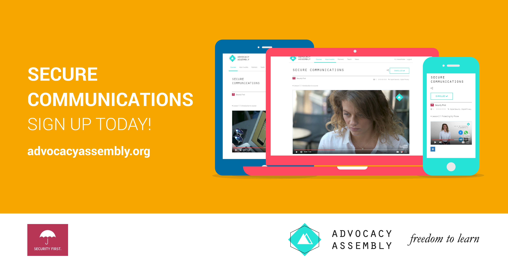

# Communications

### Introduction
Communications are often one of the most vulnerable parts of any organisations work. Even if internal communication measures are strong, often the most difficult part is securing conversations and information flow from people at risk - such as victims and sources. They often lack the technical knowledge or toolks to be able to create and sustain and effective channel of secure communications. Also, tools and techniques change rapidly and that can often leave a patchwork of systems - secure/insecure, not interoperable, with poor useability etc. 

The aim of this module is to encourage champions to select a suite of tools that will then allow them to create a simple, but consistent, framework for their organisations commmnications. 

### Learning Goals
* Understand the variety of communications conducted by the organisation 
* Understand the security vs. usability aspects of communications tools and techniques that are/will be used by the organisation

### Assessment Goals
* Develop a communications plan for their organisation based on the scenarios they face - day to day, internal, first contact, working with partners etc.

### Recommend Preparations  
N/A

### Suggested Time

45 minutes

### Notes

## Activity    
Ask participants to split into pairs. Designate one of the pair as a person seeking help (the "activist") in the field and the other as a person in their own organisation ("the staff member"). Ask them to run through scenarios such as the following:

* The activist is high profile and has often been harrassed by their local government. They are travelling out of the country and fear being detained at the airport. The staff member should advise them what to do.
* The activist has a friend who has been arrested at a protest with their laptop, camera and mobile phone. The staff member should advise them what to do.
* The activist is a whistleblower with information on widepspread government humanrights abuses. They call your organisation on their regular mobile phone looking to provide information. The staff member should advise them what to do.
* The activist calls to say that their home and office have been raided by the hostile local police. The staff member should advise them what to do.

## Discussion  
Ask participants to outline their regular communication needs by listing on post-it notes or a flip board:

* What communication tools their organisation users
* What non technical controls for communication are used within their organisation (e.g. compartmentalisation, "need to know")
* Who they have to communicate with, both inside and outside of their organisations
* When they have to communicate
* Scenarios or case studies that they have to deal with (e.g. dealing with a source with low technical skills in an area of poor infrastructure)
* What methods of managing communication within the participants organisations have been effective/ineffective?
* What methods have been used to help overcome these challenges?

## Inputs  
Many organisations face similar problems. Staff often struggle to figure out what information to protect and how. Information policies are often not linked to other policies about secure data and communication etc. 

Some organisations have tried to make this easier by creating simple systems using traffic lights (Red/Yellow/Green). For example, many governments use it to make it less complex to when know information can be shared.  

Example of a traffic light protocol recommended by [US-CERT](https://www.us-cert.gov/tlp).

Some examples of using such a system within civil society groups might include:

* Press releases might not be sensitive, so it would be considered Green and can be stored on any regular system.
* Employee data such as bank details is sensitive should  be marked as Yellow and then only be stored on an encrypted hard drive.
* Source data such as sensitive leaks is highly sensitive data, so should be marked as Red. It should always been encrypted both at rest (on a hard drive) and in transit (when communicating with the source). It should only be accessible by people with a "need to know."

It is useful to add simple policy rules about tools and techniques to make sure a system work. For example:
Tools:

* Green - Regular Email (including personal), Slack, Skype  
* Yellow - Protonmail/Tutanota, WhatsApp, Jitsi Meet, Psiphon VPN
* Red - PGP Encrypted Email, Signal, Tor 

Techniques:

* Green - Free to speak about the information to anyone of interest
* Yellow - Information should be get confidential in the office, paper copies should be locked away and shredded when not in use, all staff sign a non-disclosure agreement, have done training
* Red - Compartmentalised information control, "need to know" only, participants only read into the project when necessary, use of new accounts not connected to other work to reduce metadata   

## Deepening   
The group is now going to be divided up into groups of approximately four people. Each group is now going to try to build a Communications Plan based on the examples provided in the inputs. 

On a flipchart/post-it notes and/or a hackpad divide and utilising some of the previous work done during the discussion, ask participants to divide up answers to following into the categories of Green/Yellow/Red:

* What information are we trying to communicate?
* What tools should we use?
* What techniques should we use?
* What do we need to do to implement this within the organisation?

Example:

YELLOW - Donor information about future projects - ProtonMail, WhatsApp - Password protect all documents with password over 16 characters, only speak to them about sensitive topics in person - Ask donor to setup ProtonMail account for sensitive information, set monthly calendar reminder to periodically remind them to delete WhatsApp conversations with us.

***Interactive Online Training***   

For champions working with individuals remotely or who do not have the time to be able to train others in person. A free online short (20 minute) course with video and quizzes on communications designed by [Security First](https://wwww.secfirst.org) is available in English, Arabic and Farsi for free on [Advocacy Assembly](https://advocacyassembly.org).

## Synthesis   
Participants should turn to their assessment documentation and consider how their organisation deals with the subject matter covered in this module. Where necessary they should ask questions and work with other participants to identify any:
 
* Issues they have found that effect their organisations
* Possible solutions they have learned
* Possible difficulties they may face in implementation (ideally using the time ad experience of trainers and other participants)
* Things would need to overcome these difficulties
* Connections to other organisations or individuals that would help them
* Timeline, resources and costs for implementation

This should be noted in their assessment, for future use. 

In line with keeping this curriculum as an updated community tool, we would also ask that participants provide comments, feedback and new ideas for this module on the project website and/or Github!

## Resources
* [Umbrella App: Communications Section](https:///www.secfirst.org)
* [Security in a Box: "Keep your online communication private"](https://securityinabox.org/en/guide/secure-communication/)
* [EFF Surveillance Self Defence: "Communicating with others"](https://ssd.eff.org/en/module/communicating-others)
* [Guide for System Administrators in At‐Risk Organizations: Physical Security](https://github.com/OpenInternet/System_Administrator_Guide_Text/blob/master/en/best_practices/staff_awareness_and_communications/index.md)
* [Wikipedia: Traffic Light Protocol](https://en.wikipedia.org/wiki/Traffic_Light_Protocol)
